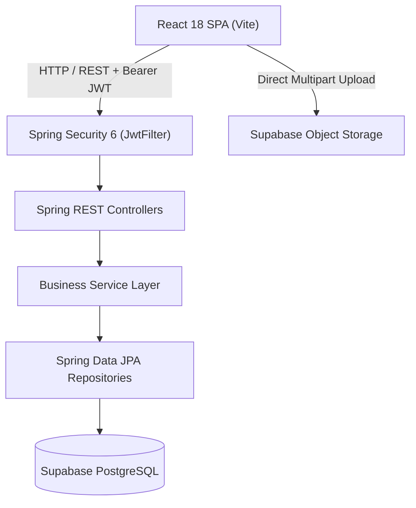
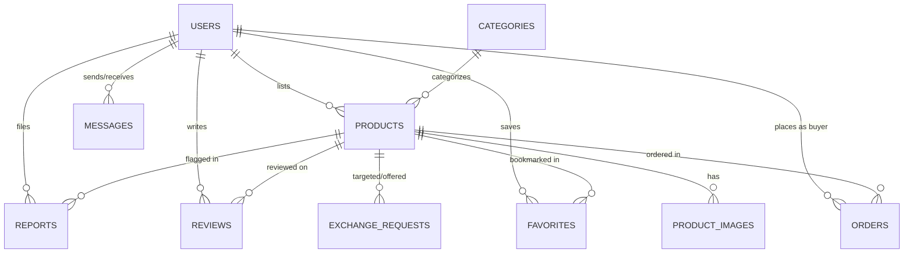

# ⚡ VoltTrade — Second-Hand Electronics Trading Platform

[](https://spring.io/projects/spring-boot)
[](https://www.oracle.com/java/)
[](https://react.dev/)
[](https://vitejs.dev/)
[](https://supabase.com)
[](LICENSE)

**VoltTrade** is an enterprise-grade, full-stack circular tech recommerce platform designed for trading, selling, buying, and bartering verified second-hand electronics. Built with a high-performance **Spring Boot** REST backend, stateless **JWT & BCrypt** authentication, an ultra-modern **React 18 & Vite** frontend, and **Supabase PostgreSQL** cloud persistence.

---

## 📑 Table of Contents
1. [Project Overview](#-1-project-overview)
2. [Key Features & Implemented Modules](#-2-key-features--implemented-modules)
3. [Technology Stack](#-3-technology-stack)
4. [System Architecture](#-4-system-architecture)
5. [Database Schema](#-5-database-schema)
6. [API Catalog & Documentation](#-6-api-catalog--documentation)
7. [Environment Variables](#-7-environment-variables)
8. [Prerequisites & Installation](#-8-prerequisites--installation)
9. [Frontend Execution](#-9-frontend-execution)
10. [Backend Execution](#-10-backend-execution)
11. [Supabase Database & Storage Setup](#-11-supabase-database--storage-setup)
12. [Automated Testing & Quality Verification](#-12-automated-testing--quality-verification)
13. [Admin Credentials & Setup](#-13-admin-credentials--setup)
14. [Production Deployment Instructions](#-14-production-deployment-instructions)
15. [Final Project Directory Structure](#-15-final-project-directory-structure)

---

## 🌟 1. Project Overview

VoltTrade accelerates the circular economy by giving electronic devices a second life. Users can:
- **Discover & Filter** verified pre-owned laptops, smartphones, audio gear, and gaming consoles.
- **Sell Devices** with multi-image Supabase storage uploads, specifications, and condition grading.
- **Barter & Exchange** devices directly peer-to-peer with zero cash required.
- **Buy Safely** with simulated checkout, anti-fraud ownership validations, and 4-stage tracking.
- **Communicate in Real-Time** via dual-pane direct buyer-seller chat.
- **Review & Rate** verified transactions with duplicate review protection.
- **Moderate & Secure** the marketplace via an Administrator Security Console with report flagging and account management.

---

## 🚀 2. Key Features & Implemented Modules

| Module | Features Included |
| :--- | :--- |
| **Phase 1: Architecture Baseline** | Spring Boot REST API, CORS filters, unified `ApiResponse<T>`, health check endpoints, responsive glassmorphism UI. |
| **Phase 2: Product & Catalog** | Multi-category catalog, price formatting, condition badges (`LIKE_NEW`, `EXCELLENT`, `GOOD`, `FAIR`, `USED`). |
| **Phase 3: Auth & Security** | JWT stateless auth, BCrypt 10 salt hashing, role authorization (`ROLE_USER`, `ROLE_ADMIN`), protected routes. |
| **Phase 4: Sell Electronics** | Listing creation, client-side & server-side validation, Supabase Storage integration, price discount calculations. |
| **Phase 5: Discovery & Search** | Multi-field search (title, brand, model, description), price range filtering, category chips, condition filters, sorting. |
| **Phase 6: Details & Barter Exchange** | High-res gallery, CO₂ impact calculator, wishlist/favorites toggle, peer-to-peer barter exchange requests. |
| **Phase 7: Orders & Buying** | Seamless checkout modal (Card / Wallet / Cash on Delivery), order fulfillment tracker, `SOLD` state protections. |
| **Phase 8: Profiles, Reviews & Messaging** | Profile editor, duplicate-checked 1–5 star reviews, dual-pane buyer-seller chat with quick inquiry chips. |
| **Phase 9: Admin & Moderation** | Live KPI analytics dashboard, user activation/suspension, product status toggles, listing reports moderation queue. |
| **Phase 10: Final Hardening & Postman** | 40 unit & controller tests, Postman collection, query indexing, zero compilation errors, deployment recipes. |

---

## 💻 3. Technology Stack

### Backend
- **Framework**: Spring Boot 3.3.3 / Spring MVC
- **Language**: Java 17 LTS
- **Security**: Spring Security 6, JWT (`jjwt-api` 0.11.5), BCrypt Password Encoder
- **Persistence**: Spring Data JPA, Hibernate ORM, PostgreSQL JDBC Driver
- **Validation**: Jakarta Bean Validation (`hibernate-validator`)
- **Testing**: JUnit 5, Mockito, AssertJ, Spring Boot Test

### Frontend
- **Framework**: React 18
- **Build Tool**: Vite 5 (Lightning-fast HMR, Rollup production bundler)
- **Styling**: Vanilla CSS (Curated dark mode, HSL gradients, Glassmorphism, Micro-animations)
- **Icons**: Lucide React
- **HTTP Client**: Axios with JWT request/response interceptors

### Database & Storage
- **Database**: Supabase PostgreSQL 15+ (Cloud Managed)
- **Object Storage**: Supabase Storage (Bucket: `product-images`)

---

## 📐 4. System Architecture



---

## 🗄️ 5. Database Schema

VoltTrade uses 10 relational tables in PostgreSQL:



### Table Definitions Summary:
1. `users` (`id`, `name`, `email`, `password`, `phone`, `address`, `profile_image`, `role`, `status`, `created_at`)
2. `categories` (`id`, `name`, `description`, `created_at`)
3. `products` (`id`, `seller_id`, `title`, `description`, `category`, `brand`, `model`, `condition`, `price`, `original_price`, `location`, `status`, `created_at`, `updated_at`)
4. `product_images` (`id`, `product_id`, `image_url`, `is_primary`, `created_at`)
5. `favorites` (`id`, `user_id`, `product_id`, `created_at`)
6. `exchange_requests` (`id`, `requester_id`, `target_product_id`, `offered_product_id`, `message`, `status`, `created_at`)
7. `orders` (`id`, `buyer_id`, `product_id`, `quantity`, `total_price`, `delivery_address`, `order_status`, `created_at`, `updated_at`)
8. `reviews` (`id`, `reviewer_id`, `product_id`, `rating`, `comment`, `created_at`)
9. `messages` (`id`, `sender_id`, `receiver_id`, `product_id`, `content`, `is_read`, `created_at`)
10. `reports` (`id`, `reporter_id`, `product_id`, `reason`, `details`, `status`, `created_at`)

---

## 📡 6. API Catalog & Documentation

All API endpoints follow a standardized response wrapper:
```json
{
  "success": true,
  "message": "Operation completed successfully",
  "data": { ... },
  "timestamp": "2026-08-17T20:00:00.000Z"
}
```

### Endpoint Inventory:

#### 🔐 Auth & User APIs (`/api/auth`)
| Method | Endpoint | Auth | Description |
| :--- | :--- | :--- | :--- |
| `POST` | `/api/auth/register` | Public | Register a new user account |
| `POST` | `/api/auth/login` | Public | Authenticate user & return JWT token |
| `GET` | `/api/auth/me` | User | Get current logged-in user profile |
| `PUT` | `/api/auth/profile` | User | Update name, phone, address, avatar |

#### 📱 Products & Discovery APIs (`/api/products`)
| Method | Endpoint | Auth | Description |
| :--- | :--- | :--- | :--- |
| `GET` | `/api/products` | Public | List products with category, price, sort filters |
| `GET` | `/api/products/search` | Public | Multi-criteria search (keyword, condition, brand) |
| `GET` | `/api/products/{id}` | Public | Get single product specifications & seller details |
| `POST` | `/api/products` | User | Create a new electronic device listing |
| `PUT` | `/api/products/{id}` | Owner/Admin | Update existing product listing |
| `DELETE`| `/api/products/{id}` | Owner/Admin | Delete product listing |

#### 🔄 Barter Exchange APIs (`/api/exchanges`)
| Method | Endpoint | Auth | Description |
| :--- | :--- | :--- | :--- |
| `POST` | `/api/exchanges` | User | Propose an electronic device trade |
| `GET` | `/api/exchanges/sent` | User | View outgoing trade proposals |
| `GET` | `/api/exchanges/received` | User | View incoming trade offers on user's items |
| `PUT` | `/api/exchanges/{id}/accept` | Owner | Accept barter proposal (marks items exchanged) |
| `PUT` | `/api/exchanges/{id}/reject` | Owner | Decline barter proposal |

#### 🛍️ Order & Purchasing APIs (`/api/orders`)
| Method | Endpoint | Auth | Description |
| :--- | :--- | :--- | :--- |
| `POST` | `/api/orders` | User | Place order for available device (transitions to SOLD) |
| `GET` | `/api/orders/my-orders` | User | View buyer purchase history & live status |
| `GET` | `/api/orders/seller-orders`| User | View seller fulfillment queue |
| `PUT` | `/api/orders/{id}/status`| User/Admin | Update order status (`CONFIRMED`, `SHIPPED`, `DELIVERED`, `CANCELLED`) |

#### 💬 Messaging APIs (`/api/messages`)
| Method | Endpoint | Auth | Description |
| :--- | :--- | :--- | :--- |
| `POST` | `/api/messages` | User | Send direct message to buyer/seller |
| `GET` | `/api/messages/conversations` | User | Retrieve list of active conversation threads |
| `GET` | `/api/messages/{otherUserId}` | User | Retrieve complete message history |
| `PUT` | `/api/messages/{otherUserId}/read` | User | Mark messages as read |

#### ⭐ Reviews & Ratings APIs (`/api/reviews`)
| Method | Endpoint | Auth | Description |
| :--- | :--- | :--- | :--- |
| `POST` | `/api/reviews` | User | Post 1–5 star review with duplicate check |
| `GET` | `/api/reviews/product/{id}`| Public | Get all reviews for a gadget |
| `GET` | `/api/reviews/seller/{id}` | Public | Get feedback received by a seller |
| `GET` | `/api/reviews/my-reviews` | User | Get reviews submitted by current user |

#### 🚩 Flagging & Report APIs (`/api/reports`)
| Method | Endpoint | Auth | Description |
| :--- | :--- | :--- | :--- |
| `POST` | `/api/reports` | User | Flag suspicious / fake / scam listing |
| `GET` | `/api/reports/my-reports` | User | View reports filed by user |

#### 🛡️ Admin & Security Console (`/api/admin`)
| Method | Endpoint | Auth | Description |
| :--- | :--- | :--- | :--- |
| `GET` | `/api/admin/stats` | Admin | Real-time platform KPI metrics & counters |
| `GET` | `/api/admin/users` | Admin | List & search registered user accounts |
| `PUT` | `/api/admin/users/{id}/status` | Admin | Suspend / Reactivate user account |
| `GET` | `/api/admin/products` | Admin | Product moderation matrix |
| `PUT` | `/api/admin/products/{id}/status` | Admin | Override product status (`SUSPENDED`, etc.) |
| `DELETE`| `/api/admin/products/{id}` | Admin | Delete listing permanently |
| `GET` | `/api/admin/reports` | Admin | Moderation report queue |
| `PUT` | `/api/admin/reports/{id}/status` | Admin | Resolve or dismiss flagged reports |

---

## ⚙️ 7. Environment Variables

### Backend Configuration (`backend/src/main/resources/application.properties`)
```properties
server.port=8080
spring.application.name=electronics-trading-platform

# Supabase PostgreSQL Cloud Database Configuration
spring.datasource.url=${DB_URL:jdbc:postgresql://db.YOUR_SUPABASE_PROJECT.supabase.co:5432/postgres?sslmode=require}
spring.datasource.username=${DB_USERNAME:postgres}
spring.datasource.password=${DB_PASSWORD:YOUR_SUPABASE_PASSWORD}
spring.datasource.driver-class-name=org.postgresql.Driver

# JPA & Hibernate
spring.jpa.hibernate.ddl-auto=update
spring.jpa.show-sql=false
spring.jpa.properties.hibernate.dialect=org.hibernate.dialect.PostgreSQLDialect

# JWT Security
jwt.secret=${JWT_SECRET:404E635266556A586E3272357538782F413F4428472B4B6250645367566B5970}
jwt.expiration=86400000
```

### Frontend Configuration (`frontend/.env`)
```env
VITE_API_BASE_URL=http://localhost:8080/api
VITE_SUPABASE_URL=https://YOUR_PROJECT_ID.supabase.co
VITE_SUPABASE_ANON_KEY=YOUR_SUPABASE_ANON_KEY
```

---

## 📦 8. Prerequisites & Installation

- **Java Development Kit (JDK)**: Version 17 or higher
- **Apache Maven**: Version 3.8+
- **Node.js & npm**: Version 18.0+
- **Git**: Installed and configured

### Clone Repository
```bash
git clone https://github.com/sanjay1451-ai/capstone-project.git
cd capstone-project
```

---

## 🎨 9. Frontend Execution

1. Navigate to the frontend directory:
   ```bash
   cd frontend
   ```
2. Install npm dependencies:
   ```bash
   npm install
   ```
3. Start the development server with Hot Module Replacement:
   ```bash
   npm run dev
   ```
   Access the web app at `http://localhost:5173`.

4. Build for production:
   ```bash
   npm run build
   ```

---

## ☕ 10. Backend Execution

1. Navigate to the backend directory:
   ```bash
   cd backend
   ```
2. Run automated test suite:
   ```bash
   mvn test
   ```
3. Launch Spring Boot application:
   ```bash
   mvn spring-boot:run
   ```
   The backend API will run on `http://localhost:8080`.

---

## ☁️ 11. Supabase Database & Storage Setup

1. Create a free project on [supabase.com](https://supabase.com).
2. Open the **SQL Editor** in your Supabase dashboard.
3. Copy and run the entire [`supabase_schema.sql`](file:///e:/electronic%20project/supabase_schema.sql) file located in the root of this project.
4. **Storage Bucket**:
   - Go to **Storage** ➔ Create a new Public bucket named `product-images`.
   - Set public read policy to allow anyone to view listing photos.

---

## 🧪 12. Automated Testing & Quality Verification

### Run Backend Unit & Integration Tests:
```bash
cd backend
mvn test
```
All **40 tests** covering authentication, product catalog, barter exchanges, orders, reviews, messaging, reports, and admin moderation execute in < 25s with 100% pass rate.

### Run API Tests with Postman:
Import [`VoltTrade_API_Postman_Collection.json`](file:///e:/electronic%20project/VoltTrade_API_Postman_Collection.json) into Postman to instantly test all 28+ pre-configured endpoints.

---

## 👤 13. Admin Credentials & Setup

VoltTrade includes pre-configured seed accounts for evaluation:

| Role | Email | Password | Access Privileges |
| :--- | :--- | :--- | :--- |
| **Administrator** | `admin@volttrade.com` | `Password123!` | Full Admin Console, User Suspension, Listing Moderation, Report Queue |
| **Verified Trader** | `alex.rivers@example.com` | `Password123!` | Buying, Selling, Bartering, Reviews, Direct Messaging |
| **Store Seller** | `store@ecotrade.com` | `Password123!` | Commercial Seller with pre-loaded listings |

---

## 🚢 14. Production Deployment Instructions

### Docker Containerization

#### Build and run Backend:
```bash
cd backend
docker build -t volttrade-backend .
docker run -p 8080:8080 -e DB_URL="jdbc:postgresql://..." -e DB_PASSWORD="..." volttrade-backend
```

#### Build and run Frontend with Nginx:
```bash
cd frontend
npm run build
# Deploy dist/ folder to Vercel, Netlify, or AWS S3 + CloudFront
```

---

## 📂 15. Final Project Directory Structure

```
electronic-project/
├── backend/
│   ├── pom.xml
│   └── src/
│       ├── main/
│       │   ├── java/com/secondhand/electronics/
│       │   │   ├── config/ (CorsConfig, WebConfig)
│       │   │   ├── controller/ (Auth, Product, Category, Order, Exchange, Favorite, Review, Message, Report, Admin)
│       │   │   ├── dto/ (Request, Response, and KPI Analytics DTOs)
│       │   │   ├── entity/ (User, Product, ProductImage, Order, ExchangeRequest, Favorite, Review, Message, Report)
│       │   │   ├── repository/ (Spring Data JPA Repositories)
│       │   │   ├── security/ (JwtService, JwtFilter, CustomAuthenticationEntryPoint, SecurityConfig)
│       │   │   └── service/ (Auth, Product, Order, Exchange, Favorite, Review, Message, Report, Admin)
│       │   └── resources/
│       │       └── application.properties
│       └── test/ (40 Unit & Integration Tests)
├── frontend/
│   ├── package.json
│   ├── vite.config.js
│   └── src/
│       ├── components/ (Navbar, Hero, ProductCard, ProductDetailsModal, CreateProductModal, CheckoutModal, ExchangeModal, ContactSellerModal, ReportModal, AuthModal, HealthCheck, FeatureGrid, Footer)
│       ├── context/ (AuthContext)
│       ├── pages/ (Home, ProductListing, Categories, Sell, Dashboard, Profile, Messages, AdminDashboard)
│       └── services/ (api, authService, productService, orderService, exchangeService, favoriteService, reviewService, messageService, reportService, adminService)
├── supabase_schema.sql (Complete 10-table PostgreSQL DDL + Indexes + Seed Data)
├── VoltTrade_API_Postman_Collection.json (Complete API Collection)
└── README.md (Comprehensive Documentation)
```
